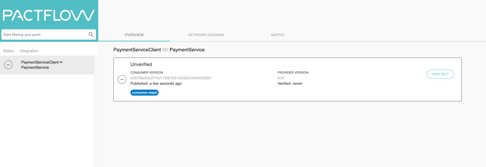
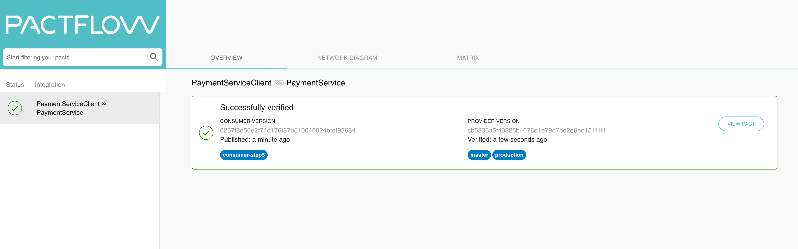

### Consumer Step 5 (Deploy)

Now that the provider API is deployed, we are ready to start the journey to deploy our consumer.

#### Creating hooks in the broker to automate contract publication and verification

Once we have our pact broker in pactflow is up and running, we need to set up the hooks on it. We are going to set up a global hook and another hook that is specific to the branch that we are developing in this consumer app.

Before creating the hooks, run `rake pact:publish`, to ensure the broker is working, you should see a contract published on your broker running on pactflow.

The first hook that we need to create is a global hook that acts on the `contract_content_changed` event. So whenever a contract is published or changed by a consumer, the `test` step for the provider's master branch will be triggered on circleci. This way, every time a contract is published or changed, we will, in an automated way, know if the provider already supports the functionality required by the consumer that generated the event.

To create the global hook, execute the following curl requests.

```bash
curl -X POST -H "Content-Type: application/json" -H "Authorization: Bearer $PACT_BROKER_TOKEN" \
  "$PACT_BROKER_BASE_URL/pacticipants" -d '{"name": "PaymentService"}'

curl -X POST -H "Content-Type: application/json" -H "Authorization: Bearer $PACT_BROKER_TOKEN" \
  "$PACT_BROKER_BASE_URL/pacticipants" -d '{"name": "PaymentServiceClient"}'

curl \
  --header "Content-Type: application/json" \
  --header "Authorization: Bearer $PACT_BROKER_TOKEN" \
  --request POST "$PACT_BROKER_BASE_URL/webhooks/provider/PaymentService/consumer/PaymentServiceClient" \
  --data '{
    "events": [{"name": "contract_content_changed"}],
    "request": {
      "method": "POST",
      "headers": { "Content-Type": "application/json" },
      "username": "'$CIRCLECI_API_TOKEN'",
      "url": "https://circleci.com/api/v1.1/project/github/'$GITHUB_USER'/pact-workshop-provider/tree/master",
      "body": {
        "build_parameters": {"CIRCLE_JOB": "verify"}
      }
    }
  }'
```

You should receive successful JSON responses back from the broker.

The first two curl requests create the pact participants and the last one creates the global hook.

Now let's create the hook that is specific to the consumer branch that we are about to deploy.

```bash
curl \
	--header "Content-Type: application/json" \
	--header "Authorization: Bearer $PACT_BROKER_TOKEN" \
	--request POST "$PACT_BROKER_BASE_URL/webhooks/provider/PaymentService/consumer/PaymentServiceClient" \
	--data '{
	  "events": [{"name": "provider_verification_published"}],
	  "request": {
	    "method": "POST",
	    "headers": { "Content-Type": "application/json" },
	    "username": "'$CIRCLECI_API_TOKEN'",
	    "url": "https://circleci.com/api/v1.1/project/github/'$GITHUB_USER'/pact-workshop-consumer/tree/consumer-step5",
	    "body": {
	      "build_parameters": {"CIRCLE_JOB": "test"}
	    }
	  }
	}'
```

You should receive a successful JSON response back from the broker.

By creating this hook, once the provider successfully verifies the contract published by this consumer, the circleci `test` step will be run for the current branch in our consumer app and we will know that it is safe to merge this feature branch to master for deploying it.

#### Deploying a consumer's feature branch

We are going to open a pull request on github for the current branch, a few things will happen:

#### Publishing the contract to the broker

- You can either run `rake pact:publish` or execute `git commit --allow-empty -m "Trigger build" && git push` to trigger a new build that will publish the contracts to the broker.
- Open a pull request on github for the current `consumer-step5` branch
- Once the build is triggered for this PR's branch, you should see a github yellow icon highlighting that the build is running.
- This build publishes the contract to the broker but it will fail on the verification step. You should see a github red icon highlighting that the build failed. The verification step fails because at this stage the provider has not yet verified this contract.

If you take a look at the broker, you should see something like this (Note that the contract is unverified)



#### Verifying the contract and publishing the results to the broker

- Because we have published a contract to the broker, the `verify` build step for the provider's master branch should run. You should be able to see this on circleci. Once this build step runs in the provider side, the contract will be successfully verified.
- The provider publishes the verification of the contract to the broker and the hook for the `provider_verification_published` event will be triggered.
- A new build for the consumer's feature branch will run again and at this stage, the build will finish successfully. You should see a github green icon highlighting that the feature branch can now be merged to master.

If the `verify` build step doesn't run for whatever reason, you can manually trigger the `verify` build step on your own by executing the following curl request:

```bash
curl -X POST -H "Content-Type: application/json" \
  "https://circleci.com/api/v1.1/project/github/$GITHUB_USER/pact-workshop-provider/tree/master" \
  -u $CIRCLECI_API_TOKEN \
  -d '{"build_parameters": {"CIRCLE_JOB": "verify"} }'
```

If the command asks for a password, just ignore it and type enter.

When the `verify` build step is done, you can take a look at the broker again, you should see something like this (Note that the contract is verified now)



#### Deploy to production

Once the build in the feature branch is green, merge the pull request to master branch to your own repository.

Go to circleci and see how the different CD steps are executed. You should see 2 CD steps: `test` and `deploy`. Wait until all the steps have completed successfully.

Once all the steps have finished, navigate to the following URL `https://pact-consumer-$GITHUB_USER.herokuapp.com/` replacing `$GITHUB_USER` with your github user name.

Congratulations, your web application is up and running and it should be able to call the provider API, you can verify it by trying to validate on the UI valid and invalid credit card numbers.

In the `pact-workshop-consumer` directory, run `git clean -df && git checkout . && git checkout consumer-step6` and follow the instructions in the **Consumers's** readme file
