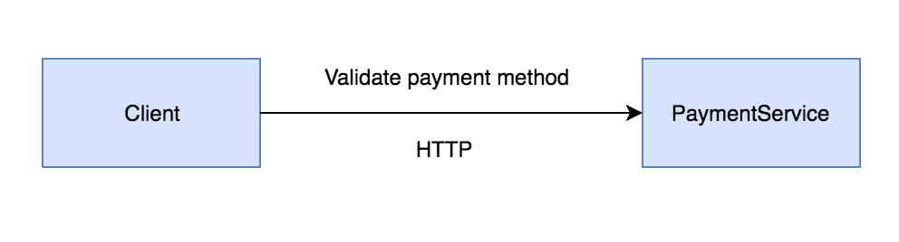

### Pre-Requirements

- Fork this github repository into your account (You will find a "fork" icon on the top right corner)
- Clone the forked repository that exists in **your github account** into your local machine

The directory structure needs to be as follows (both projects need to be cloned in the same parent directory):

```bash
drwxr-xr-x - user  7 Jun 17:56 pact-workshop-consumer
drwxr-xr-x - user  7 Jun 18:01 pact-workshop-provider
```

### Requirements

- Ruby 2.3+ (It is already installed if you are using Mac OS X).

### Consumer Step 0 (Setup)

#### Ruby

Check your ruby version with `ruby --version`

If you need to install ruby follow the instructions on [rvm.io](https://rvm.io/rvm/install)

#### Bundler

Install bundler 1.17.2 if you don't have it already installed

`sudo gem install bundler -v 1.17.2`

Verify that you have the right version by running `bundler --version`

If you have more recent versions of bundler, uninstall them with `gem uninstall bundler` until the most up to date and default version of bundler is 1.17.2

### Install dependencies

- Navigate to the `pact-workshop-consumer` directory and execute `bundle install`

### Run the tests

- Execute `rspec`

Get familiarised with the code



You can run this app by executing `bundle exec rackup config.ru -p 3000` and then navigate to http://localhost:3000/

There are two microservices in this system. A `consumer` (this repository) and a `provider`.

The "provider" is a PaymentService that validates if a credit card number is valid in the context of that system.

The "consumer" only makes requests to PaymentService to verify payment methods.

Run `git checkout consumer-step1` and follow the instructions in this readme file
